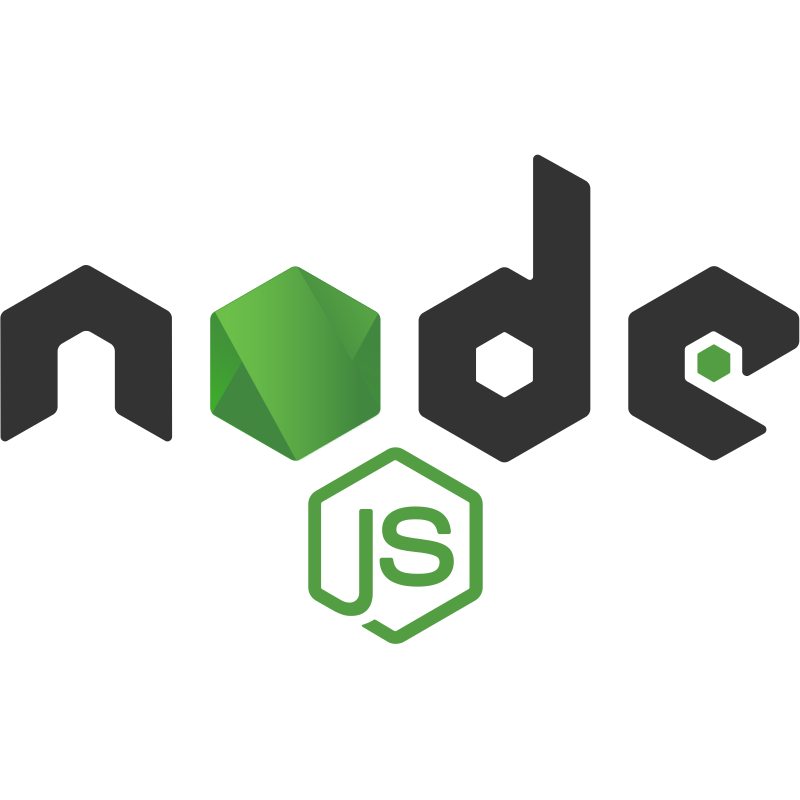

# NODE


## Tecnologias Implementadas




# Dependencias Implementadas

Express
class-transformer
reflect-metadata
mysql2
dotenv
nodemon
typescript

# Instalacion

Inicializamos en consola
```
npm init -y
```
instalamos nodemon
```
npm i -E -D nodemon
```
instalamos express
```
npm i -E -D express
```
instalamos dotenv
```
npm i -E -D dotenv
```
instalamos mysql2
```
npm i -E -D mysql2
```
instalamos class-transformer
```
npm i -E -D class-transformer
```
instalamos reflect-metadata
```
npm i -E -D reflect-metadata
```
instalamos typescript
```
npm i -E -D typescript
```

## Configuracion del .env

```
MY_CONFIG={"hostname": "", "port":}
MY_CONNECT={"host":"localhost","user":"","database":"","password":"","port":}

```

## Configuracion del tsconfig

```
{
    "compilerOptions":{
        "target":"es6",
        "module":"ES6",
        "moduleResolution":"node",
        "outDir":"./dtocontroller",
        "esModuleInterop":true,
        "experimentalDecorators":true,
        "emitDecoratorMetadata": true
    }
}
```